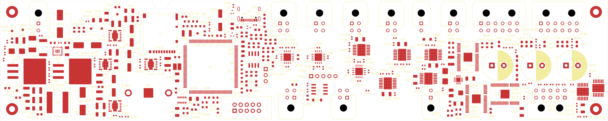

# Preliminary PCB placement — 2026-09-15

**Historical arrangement:** see the [2026-09-16 placement revision](preliminary-layout-2026-09-16.md) for the current central power section, far-right MCU, and relocated SD-card notch.

## Delivered

- 254 × 50.8 mm (10 × 2 inch) overall outline, centered on the landscape A4 sheet (297 × 210 mm). Its top-left corner is at KiCad coordinate (21.5, 79.6) mm, with its bounding-box center at (148.5, 105) mm. The grid and auxiliary origins are at the board's top-left corner. Centering translated all board items together and preserved their relative placement.
- A trapezoidal SD-card access notch is cut into the top edge in front of J1: 8 mm wide at the opening, 4 mm wide at the flat base, and 4 mm deep, with straight sloped sides. Its opening is centered at (88.925, 79.6) mm, aligned with the card outline in the existing footprint. The cut stops short of the socket body and solder pads. Component positions remain unchanged.
- 296 footprints matching the current hierarchical schematic. Removed the extra R322 footprint with no schematic association; retained the R322 linked to its schematic symbol.
- H1–H4 use the schematic's existing grounded, plated 2.5 mm mounting-hole footprint. Centers are 5 mm from the two adjacent edges. The corner-hole footprints are locked.
- TP20–TP26 now use `TestPoint:TestPoint_Pad_D1.0mm`: exposed 1 mm top copper pads with no holes or paste apertures. All seven schematic footprint assignments were updated as well.
- No routed tracks, arcs, or routing vias. Existing thermal-hole pads embedded in IC footprints remain.
- All components are on the top side. Power conversion is at the left, MCU/storage toward the center-left, and interfaces and output circuits toward their long-edge connectors. This is a preliminary placement; connector access, enclosure fit, critical pin-level placement, and power-loop geometry require refinement before routing.

### Layer order

| Layer | Use |
|---|---|
| F.Cu | Signal / Power |
| In1.Cu | GND |
| In2.Cu | +3V3 Power |
| B.Cu | Signal / Power |

The internal GND and +3V3 plane boundaries are present but **unfilled**. Nominal board thickness remains 1.6 mm. Dielectric construction and controlled-impedance geometry have not been specified or qualified with a fabricator.

### Mounting-hole coordinates

Measured from the top-left board corner, in mm:

| Reference | X | Y | Drill |
|---|---:|---:|---:|
| H1 | 5 | 5 | 2.5 |
| H2 | 249 | 5 | 2.5 |
| H3 | 249 | 45.8 | 2.5 |
| H4 | 5 | 45.8 | 2.5 |

Each hole has a 3.5 mm radius rule area prohibiting tracks, vias, and zone fills on all copper layers. The grounded mounting pads themselves remain allowed. Their eventual grounding connections are routing work, not part of this pass.

## DRC setup

**Later SD-notch check:** The project file had reverted to its original Default-only net-class settings before the notch edit. The setup table below records the earlier configuration, not the current `.kicad_pro` contents. This notch edit did not overwrite those intervening project changes. Its native DRC reports zero outline, copper-edge, or schematic-parity errors; it reports 309 other violations: 149 thermal-drill-size errors, 4 USB hole-clearance errors, 3 clearance errors, the 3 driver shorts and 3 mask bridges, and 147 driver silkscreen warnings. The 499 unrouted connection reports remain. Reconcile the saved project settings before routing.

Rules are in the project `.kicad_pro` and `.kicad_dru` files. Existing violation severities and exclusions were preserved; unresolved errors were not suppressed.

| Constraint | Value |
|---|---:|
| Minimum copper clearance | 0.15 mm |
| Minimum track / connection width | 0.15 mm |
| Copper to board edge | 0.5 mm |
| General copper to drilled hole | 0.25 mm |
| P1 internal locating-hole clearance only | 0.15 mm |
| Hole to hole | 0.25 mm |
| Minimum through-hole drill | 0.2 mm |
| Minimum routing-via diameter / annular ring | 0.6 / 0.15 mm |
| Default routing-via drill | 0.3 mm |
| Silkscreen clearance / text height / stroke | 0.15 / 0.8 / 0.12 mm |

The 0.2 mm hole minimum accommodates 149 existing thermal pad drills. P1's existing USB footprint has 0.1944 mm locating-hole-to-ground-pad clearance; only items within P1 receive the reduced hole-clearance rule. The absolute board hole-clearance floor is 0.15 mm, with the custom general rule enforcing 0.25 mm elsewhere. These are preliminary process requirements, not a declaration of a selected fabricator's capabilities. Rule behavior was checked against [KiCad 10 documentation](https://docs.kicad.org/10.0/en/pcbnew/pcbnew.html#custom_design_rules) and the native DRC run.

Microvias and blind/buried vias are prohibited. Default, LogicPower, LoadPower, InputPower, USB, and FastDigital net classes are configured, with 58 explicit assignments from the resolved netlist. Suggested widths are 0.2 mm default/digital, 0.4 mm logic supply, 1 mm load supply/output, and 2 mm input/high-current conversion nets. These are routing presets, not ampacity calculations or enforced per-net minimum widths. USB width/gap presets are not an impedance solution. The minimum width remains 0.15 mm for fine-pitch escape routing.

## Verification

KiCad 10.0.4 exported a fresh hierarchical netlist and ran DRC with schematic parity. The final netlist connectivity is identical to the initial export; the only schematic edits in this pass are the seven test-point footprint assignments.

- Exactly 296 uniquely referenced footprints; no missing or extra schematic components.
- **Zero schematic parity issues.**
- **Zero inter-footprint courtyard overlaps, copper edge-clearance errors, or invalid-outline errors.**
- Zero track/via objects and no filled copper zones.
- Seven test pads with zero drill diameter.
- Native outline dimensions: 254 × 50.8 mm.
- Reference-label overlap and edge issues were cleaned up. R102, R104, R105, R110, R113, R114, R115, and R335 have their reference fields on F.Fab because of limited silkscreen space.

### DRC findings at completion of the initial placement

**The board is not DRC-clean or ready for fabrication.** The remaining native DRC output contains:

- 499 unconnected-item reports, expected because routing has not begun.
- 3 short-circuit errors and 3 associated solder-mask bridge errors within U20, U21, and U22.
- 147 silkscreen-over-mask warnings within those same three valve-driver footprints.

The existing project library `DRV8823_DCA48_ReviewFixed.kicad_mod` places pad 32 at (2.25, -3.75) mm and pad 33 at (2.255, -3.75) mm: their centers are only 0.005 mm apart. They carry TEST and VALVE_SCLK respectively. This defect was already present in the library and embedded PCB footprints; it is independent of placement. The footprint's silk segments also cross its pad apertures. The library was not changed in this placement pass. Resolve and validate that footprint before routing these drivers.

Root-schematic ERC reports three `power_pin_not_driven` errors: U2.VBACKUP, J2.VTref, and #PWR0103. This pass did not change their nets or power-source declarations.

Generated evidence is under the ignored `analysis/` directory: `layout-drc.json`, `layout-erc.json`, `layout-final.json`, and `layout-netlist-final.xml`. Re-run the checks after further edits. This is a placement/setup record, not an electrical, thermal, EMC, or manufacturing sign-off.

## Preview



Reproduce the main checks from the repository root with KiCad 10's CLI:

```text
kicad-cli pcb drc --schematic-parity --format json -o analysis/layout-drc.json DIC_Board/DIC_Board.kicad_pcb
kicad-cli sch erc --format json -o analysis/layout-erc.json DIC_Board/DIC_Board.kicad_sch
```
