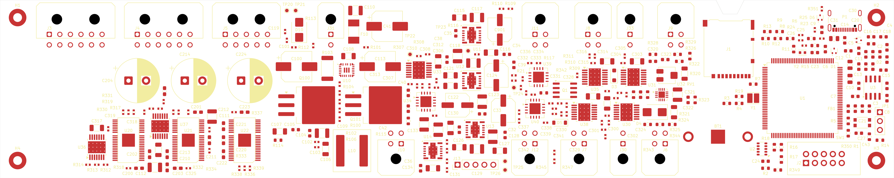

# Revised preliminary placement — 2026-09-16

The subsequent [TPS552892 BOM and PCB update](tps552892-pcb-update-2026-09-16.md) supersedes the 12 V stage placement, footprint count, and DRC totals below. The broader arrangement is retained. C41 is the 12 V stage's **input** bulk capacitor; C113 is its local output bulk capacitor.

This placement supersedes the [2026-09-15 arrangement](preliminary-layout-2026-09-15.md). The user requested central power conversion, the MCU circuit at the far right, and shorter future 12 V connections to the valve banks and LI-COR connector.

## Arrangement

- **Far left:** J3, J4, and J5 in an adjacent outward-facing top-edge row, with U20, U21, U22, their support parts, and actuator switches U36/U37 below them, opposite the MCU.
- **Middle:** the power input, 12 V buck-boost stage, and 3.3 V, 5 V, 6.6 V, and 2.8 V regulators. The smaller regulators' input/output capacitors and feedback networks are grouped around their modules.
- **Beside the valve area:** the 12 V buck-boost stage and LI-COR connector J10 with its interface/power switch. Communications, K96, RH/O2 interfaces, and pump controls occupy the area between central power and the MCU, with connectors along the long edges.
- **Far right:** U1, memory, clocks, RTC/battery, SD socket, USB, reset/boot, and debug circuitry. All 72 components on the MCU sheet have their origins within the rightmost 50 mm of the board.

The 8 mm opening / 4 mm flat base / 4 mm deep trapezoidal SD notch moved with J1. Its opening is now centered at **(228.925, 79.6) mm** in sheet coordinates, or 207.425 mm from the board's left edge. The old notch was closed.

### Placement-distance comparison

These are straight-line footprint-origin distances from the 12 V controller U10, not routed trace lengths or power-distribution calculations.

| Destination | Previous | Revised |
|---|---:|---:|
| LI-COR connector J10 | 123.6 mm | 26.1 mm |
| Valve bank U20 | 187.9 mm | 65.1 mm |
| Valve bank U21 | 171.5 mm | 49.2 mm |
| Valve bank U22 | 176.1 mm | 35.2 mm |

The 12 V output bulk capacitor C41 is above the 12 V stage, beside the connector row. Detailed routing must still determine power copper widths, return paths, current capacity, and switching-loop geometry. This remains a preliminary placement, not a datasheet-qualified final layout.

### J3–J5 connector grouping

At the user's request, J3, J4, and J5 were placed next to one another, facing outward on the top edge. Their footprint origins, measured from the board's top-left corner, are:

| Connector | X | Y | Rotation |
|---|---:|---:|---:|
| J3 | 14 mm | 9.8 mm | 0° |
| J4 | 39 mm | 9.8 mm | 0° |
| J5 | 64 mm | 9.8 mm | 0° |

Adjacent courtyard-outline gaps are approximately 1.8 mm. The connector, valve, and actuator group moved together to the far left. U20, U21, and U22 now have board-relative origins (36.5, 40), (53.5, 40), and (69.5, 40) mm, each rotated 90°. J10 is at (114, 41) mm and U10 at (98.5, 20) mm beside this group. The smaller regulators remain central. The MCU circuit, SD notch, mounting holes, layer stack, and all pad nets are unchanged. No routing was added.

The far-left placement DRC has zero new findings compared with its immediate baseline and zero schematic parity issues. The PCB and project before this move are backed up under `analysis/layout-backup/far-left-valves/`.

## Preserved

- 254 × 50.8 mm overall dimensions, centered on A4 landscape; top-left at (21.5, 79.6) mm.
- Four grounded 2.5 mm mounting holes, 5 mm from the adjacent board edges, with their keepouts and locked positions.
- Layer order: Signal/Power — GND — +3V3 — Signal/Power.
- Unfilled internal-plane outlines; no traces or routing vias.
- TP20–TP26 remain 1 mm copper pads without drilled holes.
- All footprint identities, schematic associations, and pad nets. Schematic and firmware sources were not changed.
- Current project DRC/net-class settings were not modified in this placement revision. The earlier Default-only settings issue remains documented in the previous record.

## Checks

KiCad 10.0.4 exported a fresh netlist from the hierarchy root before placement. The PCB was checked with the KiCad skill's full PCB analyzer and native DRC with schematic parity after placement.

- 296 unique footprints, with pad nets unchanged.
- Zero schematic parity issues.
- Zero invalid-outline, copper-edge-clearance, or courtyard-overlap findings.
- Zero track/via objects and zero filled zones.
- All mounting-hole coordinates preserved.
- DRC findings match the pre-edit baseline by **type, severity, and affected item UUIDs**: no new findings.

The existing baseline remains **309 violations**: 149 thermal-hole drill-size errors, 4 USB hole-clearance errors, 3 copper-clearance errors, 3 valve-footprint shorts, 3 associated solder-mask bridges, and 147 valve-footprint silk warnings. There are 499 unconnected-item reports because routing has not begun. The board is not DRC-clean or fabrication-ready. In particular, the existing U20–U22 pad 32/33 overlap still requires correction.

Silkscreen references were repositioned. Where space was insufficient, reference fields remain available on F.Fab; their list is in `analysis/revised-layout-labels.json`.

Current generated evidence: `analysis/far-left-netlist.xml`, `far-left-final.json`, `far-left-drc-before.json`, `far-left-drc.json`, and `far-left-placement.json`. These files are ignored generated outputs and should be regenerated after subsequent edits. The original pre-edit board/project backup remains under `analysis/layout-backup/2026-09-16/`.

