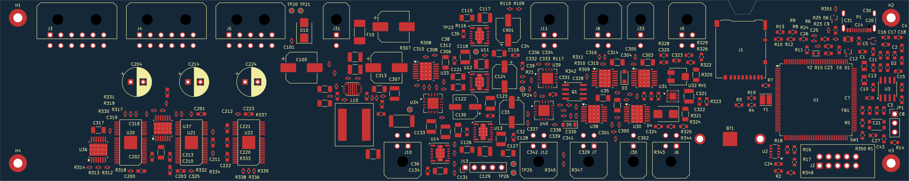

# TPS552892 BOM and PCB placement update — 2026-09-16

The PCB and existing BOM workbook now match the [TPS552892 schematic revision](tps552892-12v-update-2026-09-16.md). This is an unrouted preliminary placement, not a fabrication release.

## Changes

- U10 now uses `DIC_Board:Texas_RYQ0021A_TPS552892`, with all 21 numbered pads assigned from the fresh hierarchical netlist. Q100, Q101, R113, R114 and R115 were removed.
- The 12 V stage was regrouped in its existing central-left area. Bootstrap and local bypass components are adjacent to U10, with the inductor below and feedback/compensation to the right. The regulator origin is board-relative (98.5, 25) mm. Detailed routing must still refine switching-loop area, decoupling distances, Kelvin sensing, quiet analog returns, and thermal copper/vias. Some bulk output capacitors remain farther from U10 than the local bypass parts.
- C204, C214 and C224 now use 8 mm diameter, 3.5 mm pitch radial footprints for the 100 µF Nichicon UHE1H101MPD capacitors. Their footprint origins and rotations are preserved.
- R103 and the other changed support parts carry the updated values and schematic BOM fields. TP22 retains its 1 mm copper-pad footprint and is excluded from purchasing, like TP20–TP26.
- The existing `outputs/01a0ab21-5a0e-7063-b471-613ef4b65435/DIC_Board_BOM.xlsx` was regenerated in its previous two-tab format: **91 purchasing line items, 280 fitted components, 11 excluded PCB features**. Every fitted item has a manufacturer and MPN. Supplier fields are copied from the schematic; pricing, stock, and lifecycle were not refreshed. Shared parts with differing circuit functions use a generic value/package description to avoid attributing one function to every reference.

## Design rules

The TI land pattern has approximately 0.1772 mm clearance at four corner-pad pairs. A new rule permits 0.15 mm clearance **only between pads within U10**. The normal clearance remains applicable between U10 and external copper; the pad geometry was not reduced to satisfy a larger default rule. Land-pattern evidence: [TI SLVSH28A, package drawing 4226658/A](https://www.ti.com/lit/ds/symlink/tps552892.pdf).

The existing through-vias-only rule used the legacy `blind_buried_via` keyword. It now uses `blind_via buried_via`, preserving the intended prohibition alongside `micro_via`, according to the [KiCad 10 custom-rule syntax](https://docs.kicad.org/10.0/en/pcbnew/pcbnew.html#custom-design-rules). This also restored evaluation of the pre-existing USB internal-hole-clearance exception. No violations were suppressed or added to exclusions.

## Preserved

All footprint origins, rotations, and footprint UUIDs outside the 12 V sheet are unchanged. The board outline and SD notch, four locked grounded mounting holes, four-layer stack, unfilled plane outlines, and broader connector/MCU/valve arrangement are retained. No tracks or vias were added. Project settings and firmware were preserved.

## Checks and remaining work

- KiCad 10.0.4 fresh resolved netlist from `DIC_Board/DIC_Board.kicad_sch`: **291 unique PCB footprints**, matching every schematic footprint/value and pad net.
- Native DRC with schematic parity: **zero parity findings**, down from 69 before synchronization.
- **305 DRC violations**, down from 309 before this update. Comparison by type, severity, and affected item UUIDs found **no new violations**; four old USB hole-clearance reports disappear because the original exception is now evaluated.
- Remaining baseline: 149 thermal-hole drill-size errors, 3 valve-footprint shorts, 3 copper-clearance errors, 3 solder-mask bridges, and 147 valve-footprint silk warnings. The U20–U22 pad 32/33 overlap remains unresolved.
- **499 unconnected-item reports** are expected on this unrouted board. There are no courtyard overlaps, invalid-outline findings, or copper-edge-clearance findings.
- Root ERC: the same **two pre-existing undriven-power declarations**, U2 VBACKUP and J2 VTref. No 12 V sheet ERC findings.
- KiCad skill full PCB analyzer rerun; placement preview inspected. BOM render inspected and saved workbook read back: all 91 rows match the schematic-derived data; quantities, cached summary formulas, exclusions, and unique references reconcile.

Confidence is high for BOM/PCB synchronization and the stated native checks. This update does not establish routed current capacity, EMC compliance, thermal performance, or measured converter stability. Those require completed routing and subsequent analysis/bench testing.

The starting PCB and workbook backups and generated verification outputs are under ignored `analysis/tps552892-pcb-update/`.
